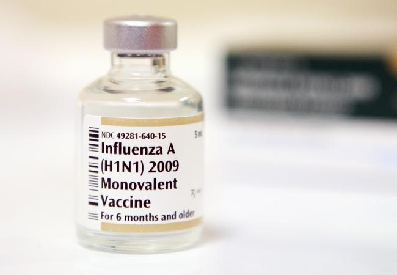
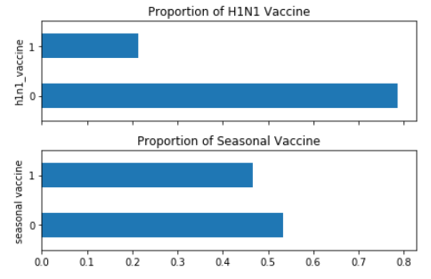
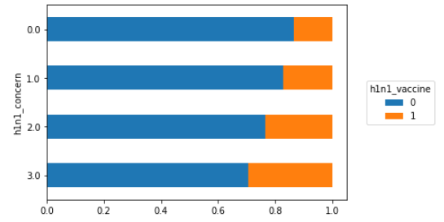

# H1N1 and Seasonal Flu Vaccination Prediction
---
## Description
A classification model made using data from a phone survey with a sample of over 26 thousand respondents that were asked several questions regarding H1N1 and the seasonal flu. Diving into what type of categories, such as age, knowledge, and concern lead to a higher correlation with receiving an H1N1 vaccine.

---
## Table of Contents
1. [Background & Motivation](#BackgroundMotivation)
2. [Data Source](#DataSource)
3. [Exploratory Data Analysis](#ExploratoryDataAnalysis)
4. [Conclusions](#Conclusions)
5. [Future Plans](#FuturePlans)
6. [Dependencies](#Dependencies)
7. [Contact](#Contact)

---
## <a id="BackgroundMotivation">Background & Motivation</a>
Vaccines for H1N1 were first publicly available in the United States in Oct 2009, when the US government began a vaccination campaign. We will look at data from the Nation 2009 H1N1 Flu Survey collected to monitor vaccination rates during that campaign.

With no current vaccine for COVID-19, I wanted to dive deeper into the previous pandemic and understand the vaccination rates during that. Looking into respondents' personal information and opinion and behaviors towards H1N1 vaccine and the seasonal flu might give us a better understanding and help further health campaigns. This phone survey asked people whether they had received H1N1 and seasonal flu vaccines, in conjunction with information they shared about their lives, opinions, and behaviors.

---
## <a id="DataSource">Data Source:</a>
[https://www.drivendata.org/competitions/66/flu-shot-learning/data/](https://www.drivendata.org/competitions/66/flu-shot-learning/data/)

training_set_features.csv (4.6MB):

26707 rows, 36 columns

`0` = No; `1` = Yes.

- `respondent_id` - a unique and random identifier.
- `h1n1_concern` - Level of concern about the H1N1 flu.
- `h1n1_knowledge` - Level of knowledge about H1N1 flu.
- `behavioral_antiviral_meds` - Has taken antiviral medications. (binary)
- `behavioral_avoidance` - Has avoided close contact with others with flu-like symptoms.
- `behavioral_face_mask` - Has bought a face mask.
- `behavioral_wash_hands` - Has frequently washed hands or used hand sanitizer.
- `behavioral_large_gatherings` - Has reduced time at large gatherings.
- `behavioral_outside_home` - Has reduced contact with people outside of own household.
- `behavioral_touch_face` - Has avoided touching eyes, nose, or mouth.
- `doctor_recc_h1n1` - H1N1 flu vaccine was recommended by doctor.
- `doctor_recc_seasonal` - Seasonal flu vaccine was recommended by doctor.
- `chronic_med_condition` - Has a chronic medical condition
- `child_under_6_months` - Has regular close contact with a child under the age of six months.
- `health_worker` - Is a healthcare worker.
- `health_insurance` - Has health insurance.
- `opinion_h1n1_vacc_effective` - Respondent's opinion about H1N1 vaccine effectiveness.
- `opinion_h1n1_risk` - Respondent's opinion about risk of getting sick with H1N1 flu without vaccine.
- `1` = Very Low; `2` = Somewhat low; `3` = Don't know; `4` = Somewhat high; `5` = Very high.
- `opinion_h1n1_sick_from_vacc` - Respondent's worry of getting sick from taking H1N1 vaccine.
- `1` = Not at all worried; `2` = Not very worried; `3` = Don't know; `4` = Somewhat worried; `5` = Very worried.
- `opinion_seas_vacc_effective` - Respondent's opinion about seasonal flu vaccine effectiveness.
- `1` = Not at all effective; `2` = Not very effective; `3` = Don't know; `4` = Somewhat effective; `5` = Very effective.
- `opinion_seas_risk` - Respondent's opinion about risk of getting sick with seasonal flu without vaccine.
- `1` = Very Low; `2` = Somewhat low; `3` = Don't know; `4` = Somewhat high; `5` = Very high.
- `opinion_seas_sick_from_vacc` - Respondent's worry of getting sick from taking seasonal flu vaccine.
- `1` = Not at all worried; `2` = Not very worried; `3` = Don't know; `4` = Somewhat worried; `5` = Very worried.
- `age_group` - Age group of respondent.
- `education` - Self-reported education level.
- `race` - Race of respondent.
- `sex` - Sex of respondent.
- `income_poverty` - Household annual income of respondent with respect to 2008 Census poverty thresholds.
- `marital_status` - Marital status of respondent.
- `rent_or_own` - Housing situation of respondent.
- `employment_status` - Employment status of respondent.
- `hhs_geo_region` - Respondent's residence using a 10-region geographic classification
- `census_msa` - Respondent's residence within metropolitan statistical areas (MSA) as defined by the U.S. Census.
- `household_adults` - Number of *other* adults in household, top-coded to 3.
- `household_children` - Number of children in household, top-coded to 3.
- `employment_industry` - Type of industry respondent is employed in. Values are represented as short random character strings.
- `employment_occupation` - Type of occupation of respondent. Values are represented as short random character strings.

training_set_labels.csv (256KB):

(26707 rows, 3 columns)

`0` = No; `1` = Yes.

- `respondent_id` - a unique and random identifier.
- `h1n1_vaccine` - Whether respondent received H1N1 flu vaccine.
- `seasonal_vaccine` - Whether respondent received seasonal flu vaccine.

## <a id="ExploratoryDataAnalysis">Exploratory Data Analysis</a>

---

We can see here that the proportion for receiving the H1N1 vaccine is much lower than getting the seasonal vaccine. Only roughly 20% of the respondents received the H1N1 vaccine, whereas almost 50% of respondents received their seasonal vaccination.

Based on the level of concern for the h1n1, the respondents behavior toward getting a vaccine differed. As concern grows, the more likely they are to receive a H1N1 vaccine.

---
## <a id="Conclusions">Conclusions</a>

The logistic regression model has an AUC of 0.83445

---
## <a id="FuturePlans">Future Plans</a>
1. Deploy a Tableau Dashboard

---
## <a id="Dependencies">Dependencies</a>
- Python
- Pandas
- Matplotlib
- Scikit-Learn
- Jupyter Notebook

---
## <a id="Contact">Contact</a>
Feel free to contact me about any questions. I can be reached through these links.  
[LinkedIn](https://www.linkedin.com/in/winrichsy/)
[Website](https://winrichsy.com)  
[Email](winrichsy@gmail.com)  
